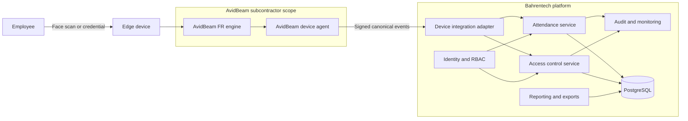
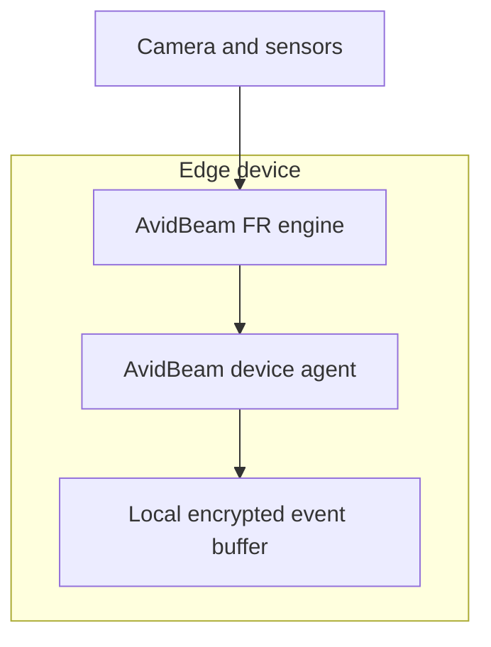
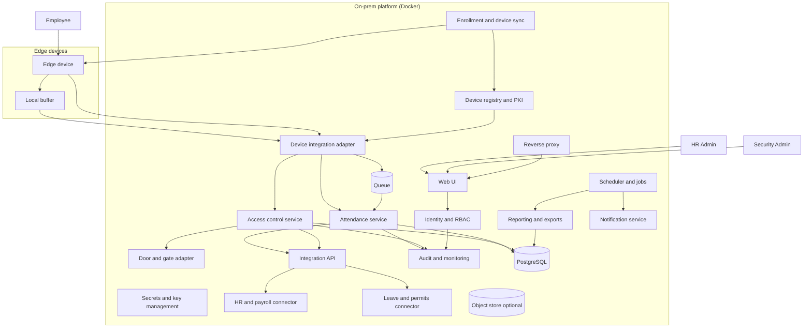
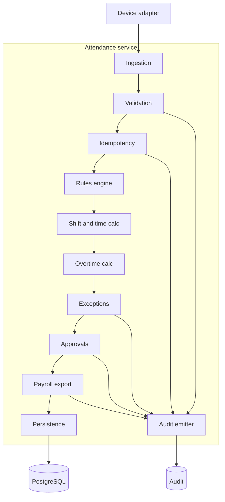
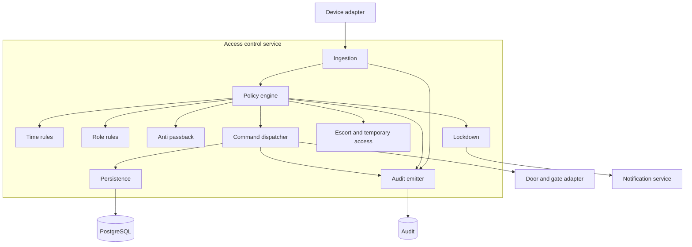
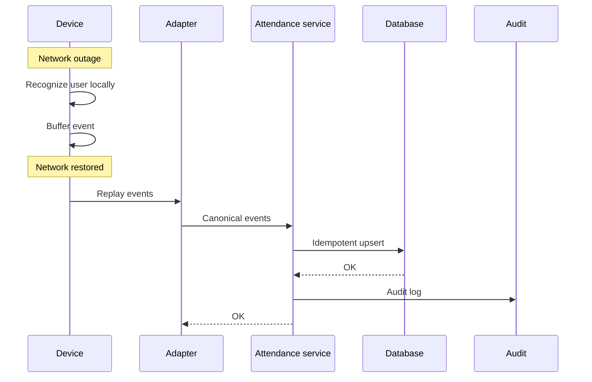

# Offline-First On-Prem Attendance, Access Control, and Monitoring System
## Prime–Subcontractor Architecture (RFP Technical Documentation)

This document describes the **complete technical architecture** and **contractual responsibility model** for an offline-first, on‑prem attendance and access control system.  
All diagrams are **GitHub-compatible Mermaid** and the document is suitable for direct inclusion in an RFP response or technical annex.

---

## 1. Contractual and Responsibility Model

### 1.1 Prime Contractor
**CNT Network Technology**

CNT Network Technology acts as the **single contractual party** and prime contractor toward the customer. CNT is responsible for:

- Overall system delivery and integration
- Commercial terms, warranties, and support coordination
- Procurement and itemization of all hardware (devices, tripods, gates, controllers)
- Subcontracting specialized software vendors
- Ensuring contractual compliance with RFP requirements

CNT purchases hardware from approved OEM vendors and subcontracts software delivery to specialist partners.

---

### 1.2 Subcontractor – Core Platform
**Bahrentech GmbH**

Bahrentech GmbH is subcontracted by CNT to deliver the **on‑prem attendance and access control platform**, including:

- Attendance management (shifts, overtime, approvals)
- Access control logic (rules, anti‑passback, lockdown)
- Identity and RBAC
- Reporting, exports, and audit logging
- HR, payroll, and leave system integrations
- Docker‑based on‑prem deployment architecture

Bahrentech does **not** implement biometric recognition algorithms.

---

### 1.3 Subcontractor – Biometric Recognition
**AvidBeam**

AvidBeam is subcontracted by CNT to provide **on‑device biometric intelligence**, including:

- On‑device facial recognition engine
- Liveness detection
- Device‑side buffering during network outages
- Device agent that emits signed recognition events

AvidBeam software runs **exclusively on edge devices** and has **no access** to business logic, databases, or reports.

---

## 2. System Context and Responsibility Boundary



**Key principle:**  
Biometric recognition (AvidBeam) is cleanly separated from attendance and access decisions (Bahrentech).

---

## 3. Edge Device Composition (Offline Operation)



- Recognition and liveness are performed locally.
- Devices remain operational during LAN outages.
- Events are replayed once connectivity is restored.

---

## 4. Core On‑Prem Platform (Containers)



---

## 5. Attendance Service – Internal Components



---

## 6. Access Control Service – Internal Components



---

## 7. Canonical Event Interface (Subcontract Boundary)

```yaml
CanonicalEvent:
  event_id: string
  device_id: string
  person_id: string
  event_type: string
  event_time_device: string
  confidence: number
  liveness: string
  signature: string
```

This contract is the **only interface** between AvidBeam and the Bahrentech platform.

---

## 8. Offline Store‑and‑Forward Sequence



---

## 9. Summary

- CNT Network Technology is the **single contractual and integration authority**
- Bahrentech GmbH delivers the **core on‑prem platform**
- AvidBeam delivers **on‑device biometric recognition**
- Responsibilities are cleanly separated and auditable
- The architecture applies **AWS serverless principles** in an on‑prem, offline‑capable environment

This structure is compliant, scalable, and defensible for regulated and public‑sector RFPs.


---

## 10. Executive Summary (Non-Technical)

### Solution Overview
The proposed solution delivers a **secure, offline-capable, on-prem attendance and access control system** designed for regulated and enterprise environments.  
It combines **on-device biometric recognition**, **centralized attendance and access logic**, and **robust reporting and audit capabilities**, all without dependency on internet connectivity.

### Key Characteristics
- **Offline-first operation**: Devices continue to function during network outages and synchronize automatically when connectivity returns.
- **Single contractual party**: CNT Network Technology provides a unified commercial and delivery interface.
- **Clear responsibility separation**: Biometric recognition, business logic, and hardware procurement are cleanly separated.
- **Vendor-agnostic platform**: Core software is not locked to any specific device manufacturer.
- **Compliance-ready**: Full audit trails, role-based access control, and secure communications.

### Business Benefits
- Reduced operational risk through offline continuity
- Lower long-term costs via hardware and vendor flexibility
- Strong compliance posture for audits and regulatory reviews
- Scalable architecture suitable for future expansion

---

## 11. RACI Matrix (Responsibilities and Accountability)

The following table clarifies **who is Responsible, Accountable, Consulted, and Informed** for each major system area.

| Area | CNT Network Technology | Bahrentech GmbH | AvidBeam | Hardware OEMs |
|----|----|----|----|----|
| Overall system delivery | A | R | C | I |
| Commercial contract & warranty | A | I | I | C |
| Hardware procurement & itemization | R | I | I | C |
| Edge device hardware | R | I | I | C |
| On-device biometric recognition | I | I | R | C |
| Device agent & buffering | I | I | R | C |
| Device certificates & identity | R | R | C | I |
| Device integration adapter | I | R | C | I |
| Attendance logic & workflows | I | R | I | I |
| Access control logic & policies | I | R | I | I |
| RBAC & identity integration | I | R | I | I |
| Reporting & exports | I | R | I | I |
| Audit logging & compliance | I | R | I | I |
| HR / payroll / leave integration | I | R | I | I |
| On-prem deployment & updates | R | R | I | I |
| System documentation | A | R | C | I |
| Support coordination | A | C | C | I |

**Legend**  
- **R** = Responsible (does the work)  
- **A** = Accountable (owns the outcome)  
- **C** = Consulted  
- **I** = Informed  

---

## 12. Architecture Defense – Common Questions & Answers

### Q: Why is biometric recognition separated from attendance logic?
**A:** To ensure auditability, security, and compliance. Biometric recognition produces facts (identity confidence), while attendance and access rules remain centrally governed and auditable.

### Q: Why is an integration adapter required?
**A:** It enforces security, normalization, idempotency, and protects core services from device-side variability—analogous to API Gateway in cloud-native architectures.

### Q: What happens if the network is unavailable?
**A:** Devices continue operating locally, buffer events, and replay them when connectivity is restored without data loss or duplication.

### Q: Is the system locked to one hardware vendor?
**A:** No. Hardware is procured independently by CNT, and the platform remains vendor-agnostic through standardized interfaces.

### Q: Who is accountable if something fails?
**A:** CNT Network Technology is the single accountable party, coordinating subcontractors as required.

---

## 13. Conclusion

This architecture aligns **technical design**, **commercial structure**, and **operational responsibility**.  
It applies proven cloud-native principles in an on-prem environment while satisfying offline, compliance, and scalability requirements typical of public-sector and enterprise RFPs.

---

## 14. Commercial Model – Fixed Price (AvidBeam Variant)

### Pricing Model
This solution is delivered under a **fixed-price commercial model** for the defined scope of work.

**Included:**
- Architecture, design, and implementation
- On-prem Docker-based deployment
- Device integration adapter
- Attendance and access control platform
- Reporting, audit, and compliance features
- Documentation and go-live support

**Excluded:**
- Hardware costs (devices, gates, tripods)
- Third-party biometric licenses (AvidBeam commercial terms)
- Customer-side UAT effort
- Operational hosting costs

### Fixed Price
**Estimated total effort:** ~245–255 man-days  
**Man-day rate:** €1,000  

➡ **Fixed price:** **€250,000**

CNT Network Technology is the single contractual and invoicing party.

---

## 15. Payment Milestone Schedule (AvidBeam Variant)

| Milestone | Description | % | Amount |
|---------|-------------|---|--------|
| M1 | Architecture, contracts, schemas approved | 20% | €50,000 |
| M2 | Attendance system & device integration complete | 30% | €75,000 |
| M3 | Access control, reporting & audit complete | 30% | €75,000 |
| M4 | Production deployment & handover | 20% | €50,000 |
| **Total** |  | **100%** | **€250,000** |

### Acceptance Criteria
Each milestone is accepted upon delivery of the agreed functionality and documentation. Acceptance shall not be unreasonably withheld.

---

## 16. Delivery Effort Breakdown (Epics, Stories, Man-Days)

The following effort breakdown is from **Bahrentech GmbH’s perspective** and forms the basis
for the fixed-price calculation. Estimates include design, implementation, unit testing,
and developer documentation.

| Epic | Description | Man-Days |
|---|---|---|
| E1 | Foundation & architecture | 16 |
| E2 | Identity & RBAC | 20 |
| E3 | Device integration adapter | 26 |
| E4 | Attendance management | 28 |
| E5 | Access control | 27 |
| E6 | Enrollment & device management | 20 |
| E7 | Reporting & exports | 18 |
| E8 | Audit & compliance | 15 |
| E9 | HR / payroll / leave integrations | 20 |
| E10 | Deployment, operations & documentation | 21 |
| **Subtotal** |  | **219** |
| Contingency (~15%) |  | **31** |
| **Total estimated effort** |  | **250 man-days** |

---

## 17. Delivery Roadmap & Timeline

Delivery follows a **milestone-driven roadmap** aligned with payment milestones.
Assuming a team of **4–5 engineers**, the total delivery duration is approximately **5–6 months**.

### Phase 0 – Project Initiation (Weeks 1–2)
- Architecture finalization
- Backlog and schemas approved
- Security baseline agreed  
**Milestone:** M1 – Architecture sign-off

### Phase 1 – Platform Foundation (Weeks 3–6)
- Core platform setup
- Identity & RBAC
- Base data models  
**Outcome:** Platform baseline operational

### Phase 2 – Device Integration & Attendance (Weeks 7–12)
- Device adapter implementation
- Offline replay tested
- Attendance rules and workflows  
**Milestone:** M2 – Attendance system complete

### Phase 3 – Access Control & Device Management (Weeks 13–16)
- Access policies, anti-passback, lockdown
- Enrollment and provisioning  
**Outcome:** Physical access control operational

### Phase 4 – Reporting, Audit & Integrations (Weeks 17–20)
- Reports and exports
- Audit and compliance
- HR / payroll / leave integration  
**Milestone:** M3 – Reporting & compliance complete

### Phase 5 – Hardening & Go-Live (Weeks 21–24)
- Performance and security hardening
- Backup and restore tests
- Documentation and handover  
**Milestone:** M4 – Production readiness

---

## 18. Delivery Capacity Assumptions & Timeline Rationale

The delivery timeline is derived from the **total estimated effort (man-days)** and a
**realistic effective team capacity**, rather than assuming perfect parallelization.

### Capacity Assumptions

- Nominal team size: **4–5 engineers**
- Average effective utilization: **60–70%**
  - Accounts for architecture alignment, reviews, integration testing,
    coordination with CNT and device vendors, and rework
- Average effective delivery capacity: **~3–3.5 full-time equivalents**

### Timeline Calculation (Illustrative)

- Total estimated effort:
  - **Suprema variant:** ~230 man-days
  - **AvidBeam variant:** ~250 man-days
- Effective monthly capacity:
  - ~45–55 man-days per month
- Resulting delivery duration:
  - **~5 months (optimistic)**
  - **~6 months (conservative, RFP-safe)**

### Rationale

This approach ensures:
- Realistic sequencing of dependent work streams
- Adequate time for integration and stabilization
- Predictable milestone acceptance and payment timing
- Reduced delivery risk for all parties

The proposed timeline prioritizes **delivery reliability and quality** over
aggressive but fragile schedules.


---

## 19. Itemized Commercial Tables (Prime Contractor – CNT Network Technology)

This section defines the **itemized commercial structure** used by CNT Network Technology
to consolidate pricing from multiple vendors.  
The same structure is reused across all hardware vendors to ensure **transparent,
line-by-line comparison**.

---

### 19.1 Software & Platform (Bahrentech – Fixed Price)

| Pos | Category | Description | Supplier | Qty | Unit Price (€) | Total (€) |
|---|---|---|---|---|---|---|
| A1 | Software Platform | On‑prem attendance & access control platform (fixed price) | Bahrentech GmbH | 1 | As contracted | As contracted |
| A2 | Documentation & Go‑Live | Documentation, runbooks, go‑live support | Bahrentech GmbH | 1 | Included | Included |

---

### 19.2 Biometric Control Software (Vendor‑Specific)

| Pos | Category | Description | Supplier | Qty | Unit Price | Total |
|---|---|---|---|---|---|---|
| B1 | Control Software | Device management / control room software | Vendor | 1 | Vendor provided | Vendor provided |
| B2 | T&A License | Time & Attendance license (user‑based) | Vendor | 1 | Vendor provided | Vendor provided |
| B3 | Access License | Access control license (door‑based) | Vendor | 1 | Vendor provided | Vendor provided |

*For vendors without proprietary control software, this section may be marked “N/A”.*

---

### 19.3 Biometric Devices (Vendor Fill‑In Table)

| Pos | Device Type | Model | Supplier | Qty | Unit Price | Total |
|---|---|---|---|---|---|---|
| C1 | Face Terminal |  |  |  |  |  |
| C2 | Face Terminal (Alt) |  |  |  |  |  |
| C3 | Edge Compute Device |  |  |  |  |  |

---

### 19.4 Power Supplies & Accessories

| Pos | Item | Description | Supplier | Qty | Unit Price | Total |
|---|---|---|---|---|---|---|
| D1 | Power Supply | Power adapter for biometric device |  |  |  |  |
| D2 | Mounting Kit | Wall / pole mounting accessories |  |  |  |  |
| D3 | Network Accessories | Switches, cabling, PoE injectors |  |  |  |  |

---

### 19.5 Gates, Tripods & Physical Access Hardware

| Pos | Item | Model | Supplier | Qty | Unit Price | Total |
|---|---|---|---|---|---|---|
| E1 | Tripod Turnstile |  |  |  |  |  |
| E2 | Full‑Height Gate |  |  |  |  |  |
| E3 | Door Controller |  |  |  |  |  |

---

### 19.6 Installation, Training & Commissioning

| Pos | Service | Description | Supplier | Price |
|---|---|---|---|---|
| F1 | Installation | Installation & commissioning on‑site | CNT / Partner | Vendor provided |
| F2 | Training | Administrator & operator training | CNT / Partner | Included / Optional |
| F3 | Warranty | Standard / extended warranty | Vendor | Vendor provided |

---

### 19.7 CNT Final Commercial Summary (Roll‑Up)

| Category | Amount |
|---|---|
| Software Platform (Bahrentech) | As contracted |
| Biometric Control Software | Vendor dependent |
| Biometric Devices | Vendor dependent |
| Gates & Tripods | Vendor dependent |
| Power & Accessories | Vendor dependent |
| Installation & Training | Vendor dependent |
| **Total (excl. VAT)** | — |
| VAT | — |
| **Total (incl. VAT)** | — |

This roll‑up table represents the **final price presented by CNT Network Technology**
to the customer after consolidating all vendor inputs.
